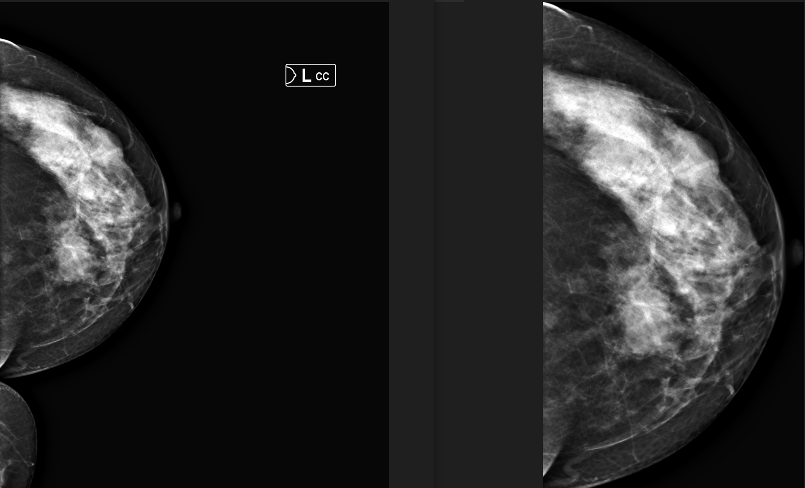

# Mammography Abnormality Detection

Computer-vision pipeline for preprocessing screening mammograms and detecting breast-tissue abnormalities, built for **TEKNOFEST 2023 — Healthcare AI Competition**, category *"BI-RADS Category and Breast Composition Estimation in Screening Mammography via Computer Vision"* (Bilgisayarlı Görüyle Tarama Mamografilerinde BI-RADS Kategorisi ve Meme Kompozisyonu Tahmini).

## Competition context

The 2023 competition asked teams to predict, from screening mammography images:

- the **BI-RADS category** of each exam,
- the **breast composition** (density class a/b/c/d), and
- the **quadrant location** of any suspicious finding.

Roughly 10,000+2,000 balanced mammography cases were shared with participants over the course of the competition. Source: [TEKNOFEST — Sağlıkta Yapay Zeka Yarışması](https://teknofest.org/tr/yarismalar/saglikta-yapay-zeka-yarismasi/).

## What's in this folder

This is the image-preprocessing and tissue-cropping toolkit built to feed clean, standardized mammogram crops into the downstream classification model:

| File | Purpose |
|---|---|
| `Tools.ipynb` | Core preprocessing functions: delabeling (removing view/side markers), CLAHE contrast enhancement, breast-side detection, pectoral-muscle removal, ROI cropping, MLO/CC view classification |
| `Breast_Cropper.pt` | Trained YOLOv5 model that detects and crops the breast-tissue region from a raw mammogram |
| `yolov5n.pt` | Base YOLOv5-nano weights used for transfer learning |
| `hubconf.py` | PyTorch Hub entry point for loading the model with `torch.hub.load(...)` |
| `Zip_To_PNG_Multi_Processing.py` / `Zip_To_Processed_Image.ipynb` | Batch conversion of zipped DICOM/image archives into processed PNGs, parallelized across workers |
| `Images/` | Example inputs/outputs for each preprocessing step (delabel, CLAHE, crop, ROI, CC/MLO views) |
| `Model_Output.png` | Example detection output from the cropping model |

### Preprocessing pipeline

```
raw mammogram
   → delabel()        remove burned-in view/side markers
   → resize()          normalize to 640x640
   → clahe()            contrast-limited adaptive histogram equalization
   → b_type()           detect breast side (left/right)
   → crop()              remove background, isolate breast tissue (pectoral muscle excluded)
   → detect_mammogram_view()   classify CC vs MLO view
```

## Setup

```bash
pip install torch torchvision opencv-python numpy
```

## Usage

Load the trained cropping model via PyTorch Hub:

```python
import torch

model = torch.hub.load(".", "custom", path="Breast_Cropper.pt", source="local")
results = model("path/to/mammogram.png")
results.show()      # visualize detection
results.crop()       # save cropped breast-tissue region
```

Or use the individual preprocessing functions directly (see `Tools.ipynb`):

```python
import cv2
from tools import delabel, resize, clahe, crop  # extracted from Tools.ipynb

img = cv2.imread("Images/RCC.png", 0)
img = delabel(img)
img = clahe(img)
img = crop(cv2.cvtColor(img, cv2.COLOR_GRAY2BGR))
```

For batch processing a directory of zipped mammogram archives:

```bash
python Zip_To_PNG_Multi_Processing.py
```

## Example output



## Pretrained models

Also published on Hugging Face:

- Tumor/mass detection — [RsGoksel/Breast-Tumor-Mass-Detection](https://huggingface.co/RsGoksel/Breast-Tumor-Mass-Detection)
- Breast-tissue cropping — [RsGoksel/Breast-Mammography-Detection](https://huggingface.co/RsGoksel/Breast-Mammography-Detection)

## License

The YOLOv5-based model code in this folder is distributed under the terms in [`LICENSE`](LICENSE) (Apache 2.0), inherited from its base architecture ([Ultralytics YOLOv5](https://github.com/ultralytics/yolov5)).
