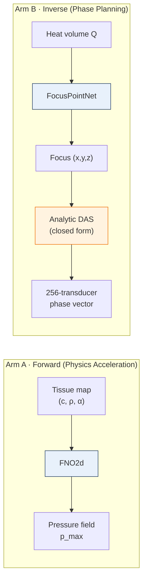

# Soft-Tissue — Neural Surrogate Models for HIFU Planning in Heterogeneous Breast Tissue

Research prototype for a symposium submission on accelerating High-Intensity Focused Ultrasound (HIFU) treatment planning with learned neural surrogates.

## What this solves

HIFU thermally ablates tumors using focused ultrasound. Clinically, the focal point must be placed with millimeter accuracy under patient-specific tissue heterogeneity — but the reference solver (k-Wave) takes **~60 seconds per configuration** on an RTX 4070, which rules out interactive planning. Frequency-domain Helmholtz solvers, ray tracing, and lookup tables each fail on a different axis (transient effects, refraction, poor patient adaptation). This gap is the engineering case for AI surrogate models — not a shortcut, but the only approach that delivers speed, GPU independence, and per-patient adaptation simultaneously.

## Pipeline

Arm A is a learned forward surrogate; Arm B is a 3-DOF focus regressor combined with closed-form analytic beamforming. An initial approach (directly predicting all 256 phases) collapsed due to gauge symmetry and a many-to-one mapping, which motivated the 3-DOF reformulation.

## Key results

**Arm A — 2D forward (1,000 OpenBreastUS samples):**

| Backbone | Test rel-L2 | vs. k-Wave wall-clock |
|---|---|---|
| **FNO2d** | **0.097** | **~7,500× speedup** (60 s → 8 ms) |
| U-Net2d | 0.264 | — |
| ConvNeXt2d | 0.990 | (generic CNN fails on this task — spectral prior dominates) |

**Arm B — 3D inverse (30 volumes, 22/4/4 split, averaged over 3 seeds):**

| Method | Lateral X (mm) | Lateral Y (mm) | Z (mm) | Wall-clock |
|---|---:|---:|---:|---:|
| argmax(Q) | 39.93 | 35.26 | 45.17 | 0.5 ms |
| weighted centroid (strongest classical) | 13.82 | 14.23 | 25.89 | 49 ms |
| threshold / parabolic / Gaussian-blur | 37–40 | 33–37 | 42–45 | 0.6–53 ms |
| **FocusPointNet (learned)** | **4.63** | **2.69** | **25.65** | **9 ms** |

FocusPointNet improves lateral X by **3.0×** and lateral Y by **5.3×**; Z accuracy is on par (data-limited). All classical peak-finders locate the heat maximum, but tissue refraction offsets it **30–50 mm** from the true target — FocusPointNet learns to correct this systematic bias.

Gauge freedom was verified three ways (analytical, synthetic least-squares, and k-Wave simulation): a `+20°` phase offset produces **0 mm** focus shift and **<1%** intensity change. The pipeline's default 5° phase quantization introduces **<0.35%** intensity error and **<0.1 mm** focus shift.

## Symposium submission

Two one-page abstracts (English + Turkish, updated with gold-standard numbers):

| Arm | English | Turkish |
|---|---|---|
| A — Forward (FNO) | [`abstract_a_en.pdf`](reports/abstract_a_en.pdf) | [`abstract_a_tr.pdf`](reports/abstract_a_tr.pdf) |
| B — Inverse (3-DOF) | [`abstract_b_en.pdf`](reports/abstract_b_en.pdf) | [`abstract_b_tr.pdf`](reports/abstract_b_tr.pdf) |

## Known limitations

- **Axial (Z) accuracy is not clinically sufficient** (~26 mm). This is a data limitation rather than an architectural one: only 30 simulations, and the Z range is 2× the lateral range.
- **The k-Wave reference assumes a 2D planar slice**; a full 3D reference was not computed due to cost.
- **The classical gold-standard comparison is limited to closed-form methods** — iterative phase optimization (CG/adjoint) over the full k-Wave forward model was out of scope for the timeline.

Full list: [`reports/technical_details.md` § Known Limitations](reports/technical_details.md#bilinen-sınırlar-limitations).

## Next steps

1. **Transfer learning** (SAM-Med3D / MONAI) — expected to bring axial RMS from 26 mm down to 10–15 mm.
2. **500+ simulations** (in progress with an ITU partner) — unlocks further downstream improvements.
3. **Transolver / GNOT for Arm A** — expected 30–50% lower rel-L2.

Full analysis: [`reports/future_work_ai.md`](reports/future_work_ai.md).

## Technical details

The initial approach's structural failure, gauge derivation, the three-architecture + heatmap DSNT ablation, the gold-standard comparison table, phase-quantization measurements, and reproduction commands are all documented in one place:

➜ **[`reports/technical_details.md`](reports/technical_details.md)**
